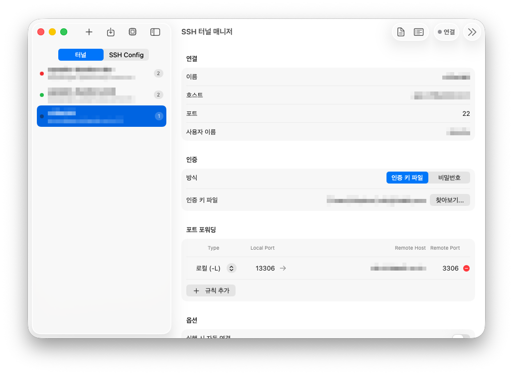

<div align="center">
    
    <h1>SSH Tunnel Manager</h1>
    
</div>

A lightweight macOS menu bar app for managing SSH tunnels. Create, connect, and organize port forwarding rules with a clean native interface.


[](https://github.com/TypoStudio/ssh-tunnel-for-macos/releases)

## Install

### Manual Installation

Download the latest `.dmg` from the [Releases](https://github.com/TypoStudio/ssh-tunnel-for-macos/releases) page, open it, and drag `SSHTunnel.app` to your `Applications` folder.

### Build from Source

```sh
# Requires Xcode and XcodeGen
brew install xcodegen
xcodegen generate
xcodebuild -project SSHTunnel.xcodeproj -scheme SSHTunnel -configuration Release build
```

## Features

### Tunnel Management
- [x] Create and manage multiple SSH tunnel configurations
- [x] Local (`-L`), Remote (`-R`), and Dynamic (`-D`) port forwarding
- [x] Multiple forwarding rules per tunnel
- [x] Connect / disconnect with a single click
- [x] Auto-connect on launch per tunnel
- [x] Disconnect on quit per tunnel
- [x] Port conflict detection before connecting
- [x] Real-time connection log viewer in a separate window
- [x] Auto-reconnect on network recovery
- [x] Auto-backup and restore settings across reinstalls

### SSH Config Integration
- [x] Browse and edit `~/.ssh/config` hosts
- [x] Load SSH Config hosts into tunnel configurations
- [x] Open config files in external editor
- [x] Raw text editing mode for SSH config entries

### Authentication
- [x] Identity file (private key) selection
- [x] Password stored securely in macOS Keychain
- [x] Additional SSH arguments support

### Share & Import
- [x] Share tunnel configs as `sshtunnel://` URLs
- [x] Import configs from share strings
- [x] Copy equivalent CLI command (`ssh -L ...`)
- [x] URL scheme handler for one-click import

### Menu Bar
- [x] Quick connect / disconnect from the menu bar
- [x] Monitor running SSH processes
- [x] Open Manager window from menu bar
- [x] Settings with launch at login option

### Localization
- [x] English
- [x] Korean (한국어)

## Keyboard Shortcuts

| Shortcut | Action |
|----------|--------|
| `⌘I` | Import from share string |
| `⌘V` | Paste share string to import |
| `⌘M` | Open Manager from menu bar |
| `⌘,` | Open Settings |
| `⌘Q` | Quit application |
| `Esc` | Close dialog |

## Requirements

- macOS 14.0 (Sonoma) or later
- SSH client (pre-installed on macOS)

## Also Available

Looking for the Windows version? Check out [SSH Tunnel Manager for Windows](https://github.com/TypoStudio/ssh-tunnel-for-win).

## License

Copyright (c) 2026 TypoStudio (typ0s2d10@gmail.com)\
https://github.com/TypoStudio/ssh-tunnel-for-macos

SSH Tunnel Manager is available under the [GNU General Public License v3.0](LICENSE).

<a href="https://www.buymeacoffee.com/typ0s2d10" target="_blank"></a>

---

## 한국어

macOS 메뉴 막대에서 SSH 터널을 간편하게 관리하는 네이티브 앱입니다.

### 설치

[Releases](https://github.com/TypoStudio/ssh-tunnel-for-macos/releases) 페이지에서 최신 `.dmg` 파일을 다운로드하고, `SSHTunnel.app`을 `응용 프로그램` 폴더로 드래그하세요.

### 주요 기능

- **터널 관리** — 로컬(`-L`), 원격(`-R`), 다이나믹(`-D`) 포트 포워딩을 클릭 한 번으로 연결/해제, 실시간 연결 로그 확인
- **SSH Config 연동** — `~/.ssh/config` 호스트를 탐색하고 터널 설정으로 불러오기
- **인증** — 인증 키 파일 선택, macOS 키체인에 비밀번호 저장
- **공유 및 가져오기** — `sshtunnel://` URL로 설정 공유, 붙여넣기로 가져오기
- **메뉴 막대** — 메뉴 막대에서 빠른 연결/해제, SSH 프로세스 모니터링
- **설정** — 로그인 시 자동 시작, 시작 시 매니저 열기
- **자동 재연결** — 네트워크 복구 시 끊어진 터널 자동 재연결
- **설정 백업** — 앱 재설치 시 터널 설정 자동 복원
- **다국어** — 영어, 한국어 지원

### 키보드 단축키

| 단축키 | 동작 |
|--------|------|
| `⌘I` | 공유 문자열에서 가져오기 |
| `⌘V` | 공유 문자열 붙여넣어 가져오기 |
| `⌘M` | 메뉴 막대에서 매니저 열기 |
| `⌘,` | 설정 열기 |
| `⌘Q` | 앱 종료 |
| `Esc` | 대화상자 닫기 |

### 요구 사항

- macOS 14.0 (Sonoma) 이상
- SSH 클라이언트 (macOS 기본 내장)

### Windows 버전

Windows 버전은 [SSH Tunnel Manager for Windows](https://github.com/TypoStudio/ssh-tunnel-for-win)에서 확인하세요.
